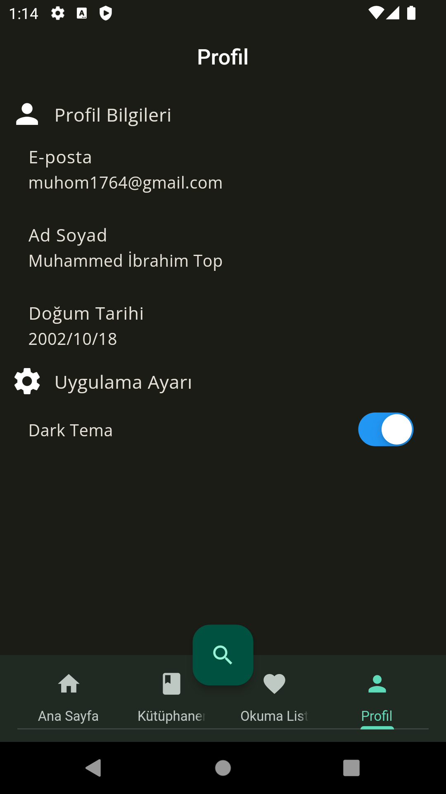

# Kitap Sarayı
(Bu uygulama eğitim içindir)

Uygulama kitap severler için geliştirilmiş olup kullanıcıların kitaplarını uygulama içinde olan 6800 kitap içinden bulup kütüphanelerine eklemelerini sağlamaktadır. Ayrıca okumak istediği kitapları da okuma listesine ekleyip kullanıcının unutmamasını sağlamaktadır.

Uygulama Futter üzerinden geliştiriği için web'de de çıkmaktadır.

Eğer desktop üzerinden açıyorsanız f12'ye basıp çıkan pencerenin sol üstündeki mobil görünümünü açınız.

[Web sürümünü denemek için tıklayınız.](https://shiori651.github.io/Kitap-SarayiWeb/#/)

[Android için APK indirme.](https://drive.google.com/drive/folders/1e9N5FtaprKEsyy0rzzgZW-fi7v4gKep-?usp=drive_link)

### Ana Sayfa

### Kütüphane

### Okuma Listesi

### Kitap Sayfası

### Gelişmiş Arama

### Dark/Light Mode

  

# Manager

Yönetim kısmı excel ile çoklu kitap ekleme, Popüler Kitapları değiştirme ve güvenlik amacıyla yapılan version kontrol sayfalarından oluşmaktadır.
Version kontrol sayfası belli en düşük version belirlenir. Kullanıcılar o version altındaki uygulamayı kullandıkları zaman hangi işletim sistemiyse o sistemin Store kısmından güncellemeye zorlamaktadır.

### Excel Import

### Popüler Kitapları Değiştirme

